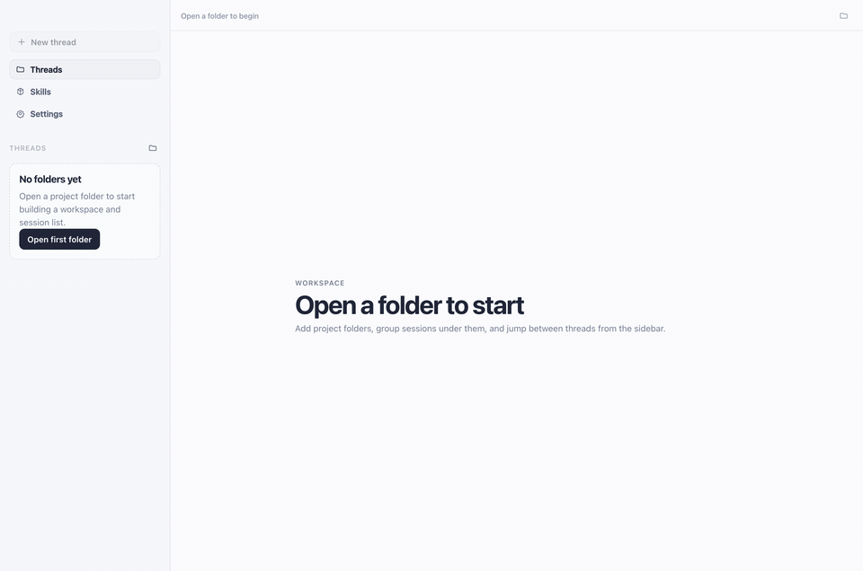

# Pi-Deepseek

<p align="center">
  
</p>

<p align="center">
  <strong>Deekseek harness GUI app for elegant pi coding agent with pi-opendesign</strong>
</p>

<p align="center">
  <a href="https://github.com/jasonet/pi-deepseek/releases/latest"></a>
  <a href="https://github.com/jasonet/pi-deepseek/releases/latest"></a>
  <a href="./LICENSE"></a>
</p>

---

## ⬇️ 下载 / Download

| 平台 | 架构 | 引擎 | 版本 | 格式 | 大小 | 下载 |
|------|------|------|------|------|------|------|
| **macOS** | Apple Silicon (M1–M4) | Electron | v2.6.4 | DMG | 136M | [](https://github.com/jasonet/pi-deepseek/releases/download/v2.6.4/Pi-Deepseek-2.6.4-mac-arm64.dmg) |
| **macOS** | Intel (x64) | Electron | v2.6.4 | DMG | 147M | [](https://github.com/jasonet/pi-deepseek/releases/download/v2.6.4/Pi-Deepseek-2.6.4-mac-x64.dmg) |
| **Windows** | x64 | Electron | v2.6.4 | 安装版 | 121M | [](https://github.com/jasonet/pi-deepseek/releases/download/v2.6.4/Pi-Deepseek-2.6.4-win-x64-setup.exe) |
| **Windows** | x64 | Electron | v2.6.4 | 便携版 | 120M | [](https://github.com/jasonet/pi-deepseek/releases/download/v2.6.4/Pi-Deepseek-2.6.4-win-x64-portable.exe) |
| **Linux** | x64 | Electron | v2.6.4 | deb | 146M | [](https://github.com/jasonet/pi-deepseek/releases/download/v2.6.4/Pi-Deepseek-2.6.4-linux-amd64.deb) |
| **Linux** | x64 | Electron | v2.6.4 | AppImage | 149M | [](https://github.com/jasonet/pi-deepseek/releases/download/v2.6.4/Pi-Deepseek-2.6.4-linux-x86_64.AppImage) |

> 🧭 **两个发行版本，互不替换、互不冲突 / Two coexisting builds:**
> **Electron `v2.6.4`** 是功能完整、全平台覆盖的成熟版本（推荐日常使用）。

> 💡 **macOS**：下载 `.dmg` 双击挂载，将 `Pi-Deepseek.app` 拖入 `/Applications`。
> **Windows**：`Setup.exe` 为安装版（推荐），`Portable.exe` 为绿色免安装版。
> **Linux**：Ubuntu/Debian/Deepin/UOS 用 `sudo dpkg -i xxx.deb` 安装；其他发行版用 `chmod +x xxx.AppImage && ./xxx.AppImage` 运行。
> 首次启动自动弹出设置引导，填入 DeepSeek API Key 即可开始。

> 💡 **macOS**: Download `.dmg`, double-click, drag `Pi-Deepseek.app` to `/Applications`.
> **Windows**: `Setup.exe` is the installer (recommended), `Portable.exe` runs directly.
> **Linux**: `sudo dpkg -i xxx.deb` for Ubuntu/Debian; `chmod +x xxx.AppImage && ./xxx.AppImage` for other distros.
> First launch auto-opens Settings for DeepSeek API key setup.

📦 [查看全部 Release & 校验文件 →](https://github.com/jasonet/pi-deepseek/releases/latest)

---

## 简介

`Pi-Deepseek` 利用 Pi coding agent 充分发挥 DeepSeek V4 Pro 的性价比（体验接近 Claude Opus 4.7，成本仅为其 N 分之一），一个面向本地 AI 编程工作流的桌面客户端。现已支持 macOS / Windows / Linux 三平台，为 `pi` 会话提供深推理、无提示词的 Codex 级工程自动交互体验。

本项目在 [`pi-gui`](https://github.com/minghinmatthewlam/pi-gui) 的基础上持续开发，并通过 `@earendil-works/pi-coding-agent` 接入上游 `pi` 运行时。



## 功能

- 桌面客户端中打开本地工作区，按工作区管理 `pi` 会话
- 创建新会话，通过 `pi` 运行时发送提示词
- 持久保存界面状态（工作区、会话、输入框草稿）
- Codex 风格的时间线与会话交互
- **内置 DeepSeek V4 Pro 1M / Flash 1M 模型**，一键配置 API Key
- **中文简体 / 中文繁體 / 日文 UI**，Settings → Appearance 即时切换
- **40+ 提供商品牌图标**，余额显示，紧凑布局
- **Open Design MCP 集成**（扩展 → Open Design → 查看 daemon 状态）
- **Cmd/Ctrl+Tab** 快速切换会话
- **自动更新**（Settings → Notifications → Auto Update）

## Open Design 使用

```bash
# 安装 Open Design MCP（在终端执行一次）
cd ~/Sites/Github/open-design
pnpm install && pnpm rebuild better-sqlite3

# 启动 daemon
od --port 7456 --no-open

# 注册为 Pi MCP server
od mcp install pi
```

安装后在 Pi 对话中直接使用：
- "用 OD 做一个登录页"
- "生成一个 pitch deck"
- "把这个按钮改成蓝色"

Pi 会自动调用 OD 工具并在对话流中显示进度。

## 本地开发

```bash
corepack enable
pnpm install
pnpm dev
```

## 构建

```bash
# macOS 双架构
pnpm --filter @pi-gui/desktop run package

# Windows x64
pnpm --filter @pi-gui/desktop run package:win

# Linux x64 (AppImage + deb)
pnpm --filter @pi-gui/desktop run package:linux
```

## 目录结构

- `apps/desktop` — Electron 桌面应用
- `packages/session-driver` — 会话驱动类型
- `packages/catalogs` — 工作区与会话目录
- `packages/pi-sdk-driver` — pi-coding-agent 适配层

## 致谢

- 原始项目：[`minghinmatthewlam/pi-gui`](https://github.com/minghinmatthewlam/pi-gui)
- 上游运行时：[`earendil-works/pi`](https://github.com/earendil-works/pi)
- 编程智能体包：[`@earendil-works/pi-coding-agent`](https://www.npmjs.com/package/@earendil-works/pi-coding-agent)

## 许可证

MIT · [Yiding by HKEZ](https://github.com/jasonet) · Copyright 2026
