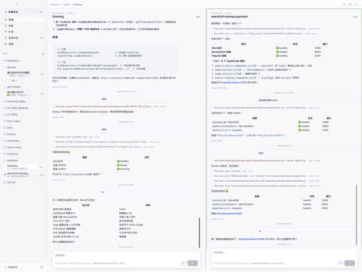
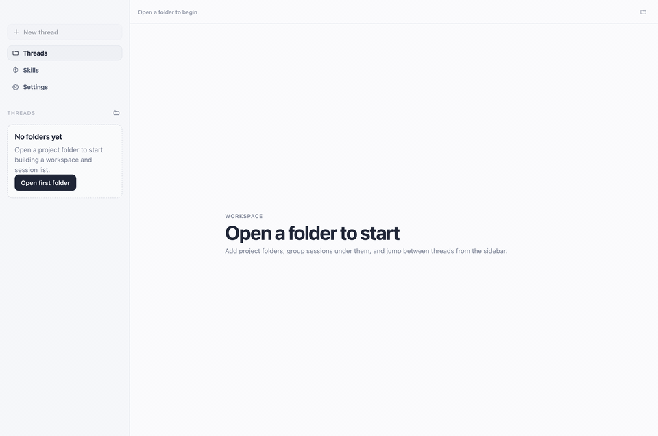

# Pi-Deepseek

<p align="center">
  
</p>

<p align="center">
  <strong>Deepseek harness Dual GUI(UnOfficial) for elegant pi/fx coding agent with DeepSeek Harness(Official) pi-opendesign & local LLM</strong>
</p>

<p align="center">
  <a href="https://github.com/jasonet/pi-deepseek/releases/latest"></a>
  <a href="https://github.com/jasonet/pi-deepseek/releases/latest"></a>
  <a href="./LICENSE"></a>
</p>

---

## ⬇️ 下载 / Download

| 平台 | 架构 | 引擎 | 版本 | 格式 | 大小 | 下载 |
|------|------|------|------|------|------|------|
| **macOS** | Apple Silicon (M1–M5) | Electron | v2.9.0 | DMG | 145 MB | [](https://github.com/jasonet/pi-deepseek/releases/download/v2.9.0/Pi-Deepseek-2.9.0-mac-arm64.dmg) |
| **macOS** | Intel (x64) | Electron | v2.9.0 | DMG | 157 MB | [](https://github.com/jasonet/pi-deepseek/releases/download/v2.9.0/Pi-Deepseek-2.9.0-mac-x64.dmg) |
| **macOS** | Apple Silicon (M1–M5) | Tauri | v2.9.0 | DMG | 147 MB | [](https://github.com/jasonet/pi-deepseek/releases/download/v2.9.0/Pi-Deepseek-2.9.0-tauri-mac-arm64.dmg) |
| **Windows** | x64 | Electron | v2.9.0 | 安装版 | 125 MB | [](https://github.com/jasonet/pi-deepseek/releases/download/v2.9.0/Pi-Deepseek-2.9.0-win-x64-setup.exe) |
| **Windows** | x64 | Electron | v2.9.0 | 便携版 | 125 MB | [](https://github.com/jasonet/pi-deepseek/releases/download/v2.9.0/Pi-Deepseek-2.9.0-win-x64-portable.exe) |
| **Linux** | x64 | Electron | v2.9.0 | deb | 157 MB | [](https://github.com/jasonet/pi-deepseek/releases/download/v2.9.0/Pi-Deepseek-2.9.0-linux-amd64.deb) |
| **Linux** | x64 | Electron | v2.9.0 | AppImage | 161 MB | [](https://github.com/jasonet/pi-deepseek/releases/download/v2.9.0/Pi-Deepseek-2.9.0-linux-x86_64.AppImage) |

> 🧭 **双引擎版本矩阵 / Dual-engine version matrix:**
> **Electron `v2.9.0`**（macOS / Windows / Linux）与 **Tauri `v2.9.0`**（macOS arm64）。macOS / Linux Electron 为完整双 harness 体验的推荐版本；Windows 因上游暂未提供 fx binary，当前为 Pi harness。
> **Electron `v2.9.0`** (macOS / Windows / Linux) and **Tauri `v2.9.0`** (macOS arm64). Electron is recommended for the complete dual-harness experience; About identifies the Electron / Tauri build.

> **v2.9.0 更新 / What's new:**
> **Pi/fx 双 harness 引擎**：检测到兼容 fx runtime 时，新任务默认左 Pi、右 fx；每栏左上角显示引擎图标与名称，并可直接交换两套独立 runtime 的左右位置。
> **内置 fx**：优先复用系统 fx 及其现有登录，找不到或不兼容时自动回退到应用内置、校验过的 fx runtime。
> **三平台 Electron 构建**：macOS、Windows、Linux 统一为 2.9.0；上游尚无 Windows fx binary，因此 Windows 保留 Pi harness 并明确提示 fx 不可用。
> *Where a compatible fx runtime is available, Pi/fx dual harnesses default to Pi on the left and fx on the right, with visible per-pane engine controls that swap the independent runtimes. The app reuses a compatible system fx login first and falls back to the verified bundled runtime on supported platforms.*

> **v2.8.0 更新 / What's new:**
> **DeepSeek Harness**：新增内置 Harness Web 页签；本机服务未启动时，明确提示运行 `npx @deepseek-ai/dsh web`。
> **本地模型**：支持自定义 OpenAI 兼容供应商和本地 LLM 端点。
> **Tauri 稳定性**：修复 sidecar IPC 参数、Node runtime 打包及 `yaml` 运行时依赖。
> *Adds the embedded DeepSeek Harness tab and offline startup guidance, custom OpenAI-compatible local LLM providers, and Tauri sidecar/runtime packaging fixes.*

> 🆕 **v2.7.0 更新 / What's new:**
> ⚡ **性能优化**：代码分割（首屏 JS ↓49%）、8 个视图懒加载（Settings/Skills/Extensions/ConnectPhone/Terminal/Diff/Tree）、SessionRecord 快取跳过重建
> 🧠 **内存优化**：Transcript 缓存 LRU（上限 12 session）、Session data Maps 上限（64 + running）、移除 structuredClone 深拷贝、定期 GC
> 🛡️ **稳定性**：30 天 × 20 workspace 长期运行零洩漏验证通过
> *Performance & memory overhaul: code splitting (-49% initial JS), 8 lazy-loaded views, SessionRecord cache skipping, transcript LRU, bounded session data maps, periodic GC.*

> 💡 **macOS**：下载 `.dmg` 双击挂载，将 `Pi-Deepseek.app` 拖入 `/Applications`。
> **Windows**：`Setup.exe` 为安装版（推荐），`Portable.exe` 为绿色免安装版。
> **Linux**：Ubuntu/Debian/Deepin/UOS 用 `sudo dpkg -i xxx.deb` 安装；其他发行版用 `chmod +x xxx.AppImage && ./xxx.AppImage` 运行。
> 首次启动自动弹出设置引导，填入 DeepSeek API Key 即可开始。

📦 [查看全部 Release & 校验文件 →](https://github.com/jasonet/pi-deepseek/releases/latest)

---

## 简介

`Pi-Deepseek` 利用 Pi/fx coding agent 充分发挥 DeepSeek V4 Pro/Flash（DeepSeek已经失去性价比，目前首推codex订阅，fx可以无缝login openai codex/grok），同时内置了DeepSeek Harness Web UI（npx @deepseek-ai/dsh web），一个面向本地 AI 编程工作流的桌面客户端。现已支持 macOS / Windows / Linux 三平台，为 pi和fx 会话提供深推理、无提示词的 Agent 级工程自动交互体验。



## Pi 与 fx 的主要区别 / Pi vs fx

| 能力 | Pi harness | fx harness |
|---|---|---|
| Runtime | 应用内的 `pi-mono` / `pi-coding-agent` 运行时 | Vercel fx 原生程序，通过 ACP 接入 |
| 强项 | 完整工具、Skills、Extensions、图片/文件附件、队列与 steer、自定义/本地模型 | 独立上下文与模型会话、快速并行验证、复用现有 fx 登录与配置 |
| 会话 | Pi 原生会话格式，由桌面端薄封装管理 | fx 原生 session，由 fx 自己保存和恢复 |
| 适合 | 主工程实现、深度仓库操作、需要 Pi 扩展生态的任务 | 第二意见、独立方案、并行分析与 fx 工作流 |

2.9 新增 **Pi/fx 双 harness 引擎**。在兼容 fx runtime 的 macOS / Linux Electron 构建中，每个新任务建立一对相互关联但运行时隔离的会话：默认左侧 Pi、右侧 fx；两栏左上角的图标化控件会说明当前 harness，并可一键交换左右位置。两者共享同一项目目录和桌面会话目录，但不合并上下文、认证或 runtime，因此既能发挥各自完整能力，也要避免同时修改同一个文件。

Version 2.9 adds the **Pi/fx dual-harness engine**. On macOS/Linux Electron builds with a compatible fx runtime, every new task creates an isolated companion pair: Pi on the left and fx on the right by default. The icon controls in the upper-left of each pane identify the active harness and can swap their positions. Both harnesses share the project directory and desktop catalog, but keep runtime, authentication, context, and native session storage independent.

本项目在 [`pi-gui`](https://github.com/minghinmatthewlam/pi-gui) 的基础上持续开发，并通过 `@earendil-works/pi-coding-agent` 接入上游 `pi` 运行时。



### DeepSeek Harness 数据图分析（15 张数据图了解 DeepSeek Harness）

<video src="./docs/readme/pi-deepseek-demo.mp4" controls width="540"></video>

> 来源：[15 张数据图帮你了解 DeepSeek Harness — @op7418（歸藏）](https://x.com/op7418/status/2088199058313957734)
> Source: [15 charts to understand DeepSeek Harness — @op7418 (guizang.ai)](https://x.com/op7418/status/2088199058313957734)

## 功能

- 桌面客户端中打开本地工作区，按工作区管理 `pi` 会话
- 创建新会话，通过 `pi` 运行时发送提示词
- 持久保存界面状态（工作区、会话、输入框草稿）
- Codex 风格的时间线与会话交互
- **内置 DeepSeek V4 Pro 1M / Flash 1M 模型**，一键配置 API Key
- **中文简体 / 中文繁體 / 日文 UI**，Settings → Appearance 即时切换
- **40+ 提供商品牌图标**，余额显示，紧凑布局
- **Open Design MCP 集成**（扩展 → Open Design → 查看 daemon 状态）
- **Cmd/Ctrl+Tab** 快速切换会话
- **自动更新**（Settings → Notifications → Auto Update）
- **Pi/fx 双 harness 双列布局**：默认左 Pi、右 fx；图标化引擎控件可交换左右位置，`Cmd+D` 分列 / `Cmd+W` 关列 / `Cmd+[` `Cmd+]` 切换 / 拖拽调整比例
- **包管理（Packages）** 🆕：在「扩展」面板为工作区安装 / 更新 / 移除 npm / git / 本地包
- **系统提示词补充** 🆕：在「扩展」面板编辑项目级 `.pi/APPEND_SYSTEM.md` 与全局 `APPEND_SYSTEM.md`，将自定义内容追加到 agent 系统提示词（项目文件优先于全局，对新建 / 重新加载的会话生效）
- **Dual-engine 统一版本**：Electron + Tauri 同步发版，版本号对齐

## Open Design 使用

```bash
# 安装 Open Design MCP（在终端执行一次）
cd ~/Sites/Github/open-design
pnpm install && pnpm rebuild better-sqlite3

# 启动 daemon
od --port 7456 --no-open

# 注册为 Pi MCP server
od mcp install pi
```

安装后在 Pi 对话中直接使用：
- "用 OD 做一个登录页"
- "生成一个 pitch deck"
- "把这个按钮改成蓝色"

Pi 会自动调用 OD 工具并在对话流中显示进度。

## 本地开发

```bash
corepack enable
pnpm install
pnpm dev
```

## 构建

```bash
# macOS 双架构
pnpm --filter @pi-gui/desktop run package

# Windows x64
pnpm --filter @pi-gui/desktop run package:win

# Linux x64 (AppImage + deb)
pnpm --filter @pi-gui/desktop run package:linux
```

## 目录结构

- `apps/desktop` — Electron 桌面应用
- `packages/session-driver` — 会话驱动类型
- `packages/catalogs` — 工作区与会话目录
- `packages/pi-sdk-driver` — pi-coding-agent 适配层

## 致谢

- 原始项目：[`minghinmatthewlam/pi-gui`](https://github.com/minghinmatthewlam/pi-gui)
- 上游运行时：[`earendil-works/pi`](https://github.com/earendil-works/pi)
- fx 引擎：[`vercel-labs/fx`](https://github.com/vercel-labs/fx) — Vercel 官方 AI coding agent，通过 ACP 接入双 harness 工作流
- DeepSeek Harness：[`deepseek-ai/deepseek-harness`](https://github.com/deepseek-ai/deepseek-harness) — DeepSeek 官方开发环境，支持扩展 / 插件体系与 Harness Web UI
- 编程智能体包：[`@earendil-works/pi-coding-agent`](https://www.npmjs.com/package/@earendil-works/pi-coding-agent)

## 许可证

MIT · [Yiding by HKEZ](https://github.com/jasonet) · Copyright 2026
